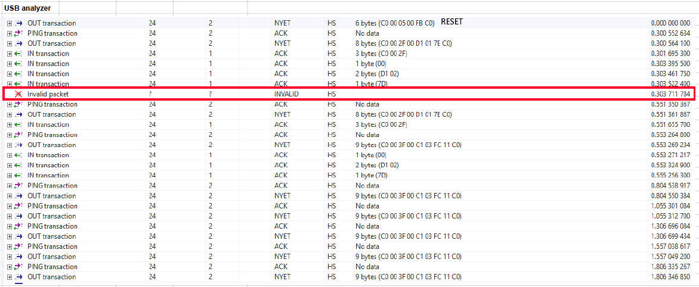

# Known Issues

## SoftDevice API Issues

#### Errors related to advertisement (SDv6)

In SoftDevice API v6 advertisement data can be changed during advertisement.
If the user change the advertisement data (`sd_ble_gap_adv_set_configure`) while there is a pending `BLE_GAP_EVT_ADV_SET_TERMINATED` event it will cause issues. In this scenario the data in the `BLE_GAP_EVT_ADV_SET_TERMINATED` event will be NULL. This is a deviation from the SoftDevice API v6 documentation.


## Windows Issues

#### /dev/null git apply issue

`Git` >= 2.19.0 is required to solve this issue.

#### CreateProcess issue

```
echo  Makefile
CreateProcess(NULL,echo Makefile,...)
process_begin: CreateProcess(NULL, echo Makefile, ...) failed.
Putting child 01DD8B10 (_build) PID 31536216 on the chain.
Live child 01DD8B10 (_build) PID 31536216
make (e=2): The system cannot find the file specified.
Reaping losing child 01DD8B10 PID 31536216
make: *** [Makefile:323: _build] Error 2
Removing child 01DD8B10 PID 31536216 from chain.
```

This issue is due to having `sh` or `bash` in PATH.
`sh` or `bash` must not be in the PATH.

#### Long paths issue

```
Compiling file: ble_gap_evt_conn.c
../../../../../../components/serialization/connectivity/codecs/ble/serializers/ble_gap_evt_conn.c:46:10: fatal error: conn_ble_gap_sec_keys.h: No such file or directory
#include "conn_ble_gap_sec_keys.h"
^~~~~~~~~~~~~~~~~~~~~~~~~
compilation terminated.
make: *** [../../../../../../components/toolchain/gcc/Makefile.common:272:
```

In the Windows API (with some exceptions discussed in the following paragraphs), the maximum length for a path is MAX_PATH, which is defined as 260 characters. If the path length exceeds MAX_PATH, then it will have this issue.
[See more details here](https://docs.microsoft.com/en-us/windows/desktop/fileio/naming-a-file#paths)


---
## macOS Issues

#### Timeout error related to the SEGGER J-Link firmware

On macOS there is a known issue with the SEGGER J-Link firmware (that runs on the Debug probe on the board) related to USB packet sizes. This results in the timeout error `Failed to open nRF BLE Driver. Error code: 0x0D` when the serial port is attempted to be opened.

There are two ways to solve this issue:

1. Use the SEGGER firmware, but disable the Mass Storage Device (MSD) feature. Instructions are available [here](https://wiki.segger.com/index.php?title=J-Link-OB_SAM3U).

2. Replace the firmware on the Debug probe with the mbed DAPLink firmware:
    - Enter bootloader mode by powering off the nRF5 Development Kit and then pressing IF BOOT/RESET while you power on the kit.
    - Drag and drop the [nrf5x_osx_fix.bin](https://github.com/NordicSemiconductor/pc-ble-driver/blob/master/tools/nrf5x_osx_fix.bin) file into the BOOTLOADER mass storage device.

If you want to revert back to the SEGGER firmware you will have to download the it from [this location](http://www.nordicsemi.com/eng/nordic/Products/nRF51-DK/nRF5x-OB-JLink-IF/52276)


---
## SEGGER J-Link-OB Issues

#### Data corruption or drops

Due to a known issue in Segger’s J-Link-OB firmware, depending on your operating system and version you might experience data corruption or drops if you use the USB CDC ACM Serial Port with packets larger than 64 bytes. This has been observed on both GNU/Linux and macOS.

To avoid this, you can simply disable the Mass Storage Device by opening:

On GNU/Linux or macOS JLinkExe from a terminal
On Microsoft Windows the “JLink Commander” application
And then typing the following:

```bash
MSDDisable
```

#### Invalid USB packets/drops data

SEGGER J-Link-OB sends invalid USB packets from J-Link-OB UART to USB host and drops data.

For example, SEGGER J-Link-OB does not send 0xC0, 0x00 from UART to USB host.
After 0xD1 0x02 0x7D is received no more data is received in PC application, CTS is kept high.
This has been observed in Linux using VirtualBox with Oracle VM VirtualBox Extension Pack.




The only way to mitigate this is to not use VirtualBox.

#### Starts clocking data at 9600 baud

Sometimes SEGGER-J-Link-OB starts to clock UART data at 9600 baud even if a different baud rate is configured.

This leads to timeout errors (NRF_ERROR_TIMEOUT) in pc-ble-driver since the connectivity firmware is not able to interpret the data.

The only way to mitigate this is to close the serial port and try again.

#### Hardware flow control detection

Sometimes SEGGER-J-Link-OB gets the hardware flow control detection wrong. A generic way to circumvent this is to open the UART port and use a dummy baud rate first and then use the wanted baud rate. This will restart the hardware flow control detection. This mitigation is implemented in pc-ble-driver.
